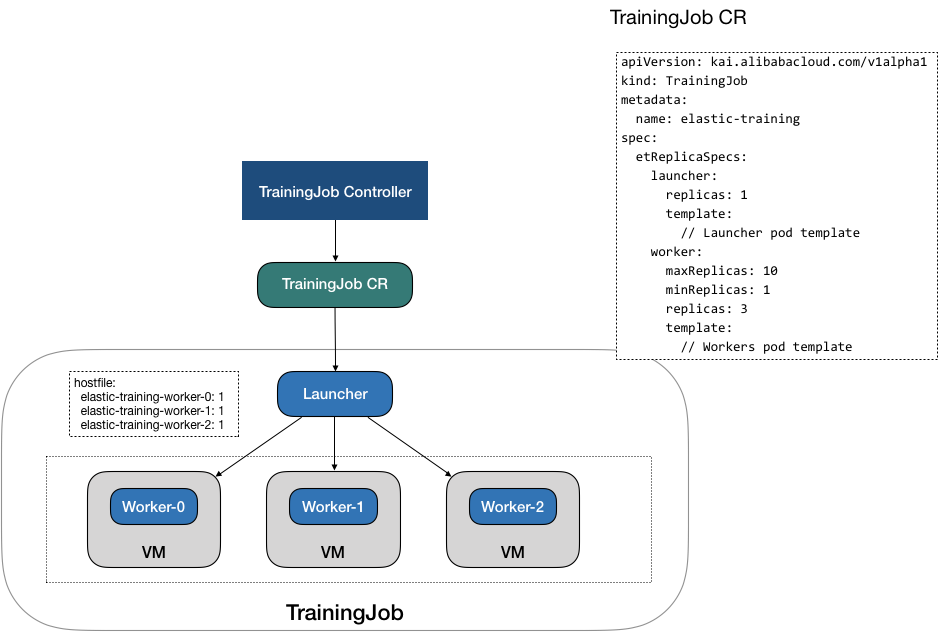
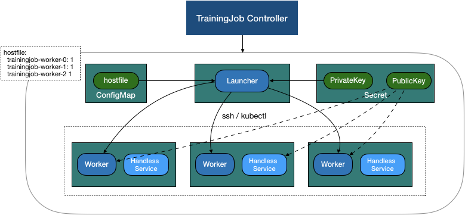
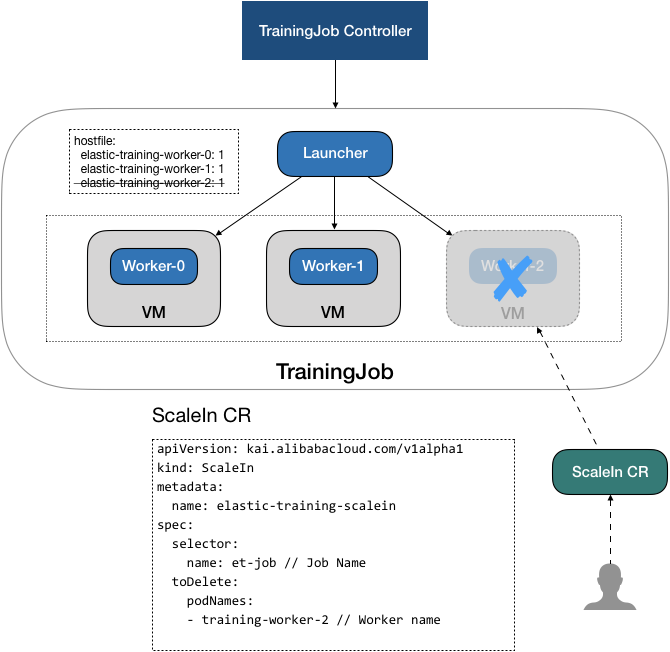
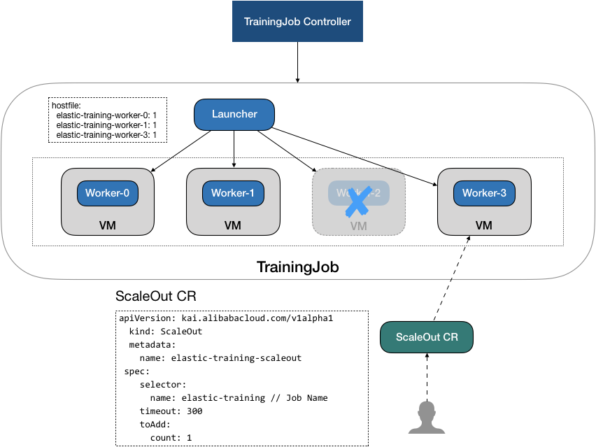

# Elastic Training Operator

## Overview

Some distributed deep learning training framework like [horovod](https://github.com/horovod/horovod)  support elastic training, which enables training job scale up and down the number of workers dynamically at runtime without interrupting the training process.

Et-operator provides a set of Kubernetes Custom Resource Definition that makes it easy to run horovod or AIACC elastic training in kubernetes. After submit a training job, you can scaleIn and scaleOut workers during training on demand, which can make your training job more elasticity and efficient.


## Design
The `et-operator`, work with 3 new CRDs, `TrainingJob`, `ScaleIn` and `ScaleOut`.

### TrainingJob 
User submit a `TrainingJob` CR to specify a training job detail, like launcher's and worker's image, entrypoint command, replicas of workers.
The `et-operator` will receive the creation event, then create the sub resource (like pods, configmap, service, secret) of the `TrainingJob`, and 




The `TrainingJob` will create workers pods and services, generate the `Secret` and `ConfigMap` for launcher pod,
when all workers ready, then operator will create the launcher pod and sync pods status. 

After launcher pod exit, `et-operator` will update `TrainingJob` phase to `Success` or `Fail` according to pod's exit code,
then do the cleanup.



#### ScaleIN
We can submit ScaleIn and ScaleOut resource to specify the scaleOut and scaleIn action of `TrainingJob`.

After the `TrainingJob` start running, `et-operator` will continuously check whether there are available `ScaleIn` and `ScaleOut` CR, and execute it.  

In `ScaleIn` CR, we can specify the trainingJob's name and which workers that need to scaleIn (by `count` or detail worker's name). 
When `et-operator` find an available `ScaleIn` CR, it will start to execute the scalein operation.
Firstly, it will update the host config of `TrainingJob`, 
In horovod elastic mode, it needs a script that return the host's topology , the change of hosts will notify the launcher, then and it will shutdown the worker process not in hosts gracefully.  
  
After the hostFile updated, `et-operator` start to detect whether the launch process exist, 
when `et-operator` confirm that the scalein worker's launch process not exit, it will delete the worker's resource.  




#### ScaleOut
In `ScaleOut` CR, we can specify the trainingJob's name and the count that we want to scaleout. 
When `et-operator` start to execute the scalein operation,
different from scaleIn, it will firstly create the new worker's resources.
After worker's resources ready, then update the hostFile. 
  




## Setup
### Installation

```
git clone http://github.com/aliyunContainerService/et-operator
cd et-operator
kubectl create -f config/deploy.yaml
```

Or you can customize some config, and run:

```
make deploy
```

You can check whether the Training Job custom resource is installed via:

```
kubectl get crd

```

```
NAME                                    CREATED AT
scaleins.kai.alibabacloud.com           2020-11-11T11:16:13Z
scaleouts.kai.alibabacloud.com          2020-11-11T11:16:13Z
trainingjobs.kai.alibabacloud.com       2020-11-11T11:16:13Z
```

Check the operator status

```
kubectl -n kube-ai get pod
```

```
NAME                          READY   STATUS    RESTARTS   AGE
et-operator-ddd56ff8c-tdr2n   1/1     Running   0          59s

```


## User guide

### Create a elastic training job
The training code need to be constructed in in elastic training mod,  [see detail](https://horovod.readthedocs.io/en/stable/elastic_include.html).
You can create an Training job by submit an TrainingJob YAML file. You can goto [Horovod TrainingJob Example](./example/training_job.yaml) to see the example, and you can modify it in need.


```
kubectl apply -f examples/training_job.yaml

```

#### Check TrainingJob status

```
# kubectl get trainingjob
NAME                          PHASE     AGE
elastic-training              Running   77s
```

```
# kubectl get po
NAME                                      READY   STATUS             RESTARTS   AGE
elastic-training-launcher                 1/1     Running            0          7s
elastic-training-worker-0                 1/1     Running            0          10s
elastic-training-worker-1                 1/1     Running            0          9s
```


### ScaleIn training job
When you need to scaleIn the trainingJob workers, you can submit an ScaleIn CustomResource.
In `Scalein` Spec, you need to spec the name of TrainingJob, et-operator will find the match trainingJob and execute scaleIn to it. You can specify the workers to scaleIn [ScaleIn by count](./example/scale_in_pod.yaml) or just specify the count [ScaleIn by count](./example/scale_in_count.yaml) .

```
kubectl create -f examples/scale_in_count.yaml


```
#### Check Scalein status

```
# kubectl get scalein
NAME                                     PHASE            AGE
scalein-sample-t8jxd                     ScaleSucceeded   11s
```


```
# kubectl get po
NAME                                      READY   STATUS             RESTARTS   AGE
elastic-training-launcher                 1/1     Running            0          47s
elastic-training-worker-0                 1/1     Running            0          50s
```

### ScaleOut training job
When you need to scaleOut the trainingJob workers, you can submit an ScaleOut CustomResource, which just specify the count of workers you want to scaleOut.

```
kubectl create -f examples/scale_out.yaml

```
#### Check ScaleOut status

```
# kubectl get scaleout
NAME                                     PHASE            AGE
elastic-training-scaleout-9dtmw          ScaleSucceeded   30s

```

```
# kubectl get po
NAME                                      READY   STATUS             RESTARTS   AGE
elastic-training-launcher                 1/1     Running            0          2m5s
elastic-training-worker-0                 1/1     Running            0          2m8s
elastic-training-worker-1                 1/1     Running            0          40s
elastic-training-worker-2                 1/1     Running            0          40s
```


## Roadmap

* Use `kubectl exec` replace ssh: the block major problem is that `kubectl exec` will hang when target pod shutdown but what we want is to exit process. 
* Support spot instance in public cloud platform, before node released, we should trigger a scaleIn to the training worker who's workers on the spot nodes.
* Support fault tolerance

## Developing
Prerequisites:

* Go >= 1.8
* kubebuilder >= 0.4.1

```
mkdir -p $(go env GOPATH)/src/github.com/aliyunContainerService
cd $(go env GOPATH)/src/github.com/aliyunContainerService
git clone https://github.com/aliyunContainerService/et-operator
cd et-operator
make
```

Build operator

```
export IMG=<image repo>
make docker-build
make docker-push

```


Running operator in local

```
make run-local
```

